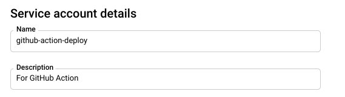

# GitHub Actions for Cloud Run Getting Started

This tutorial describes how to use [GitHub Actions](https://github.com/features/actions) for building app and deploying to Google Cloud Run

- GitHub Actions
  - > GitHub Actions makes it easy to automate all your software workflows, now with world-class CI/CD. Build, test, and deploy your code right from GitHub. Make code reviews, branch management, and issue triaging work the way you want.

## Description

### Create a Service Account
This step will create a Service Account which anthenticate GitHub Action calls to GCP project.
```
$ gcloud iam service-accounts create github-action-deploy \
    --description="For GitHub Action" \
    --display-name="github-action-deploy"
```



### Bind Roles
This step will grant the minimum permission nesessary.

- Cloud Run Admin
  - `roles/run.admin`
- Storage Admin
  - `roles/storage.admin`
- Service Account
  - `roles/iam.serviceAccountUser`

```
$ gcloud projects add-iam-policy-binding (gcloud config get-value project) --member serviceAccount:github-action-deploy@(gcloud config get-value project).iam.gserviceaccount.com --role roles/run.admin
$ gcloud projects add-iam-policy-binding (gcloud config get-value project) --member serviceAccount:github-action-deploy@(gcloud config get-value project).iam.gserviceaccount.com --role roles/storage.admin
$ gcloud projects add-iam-policy-binding (gcloud config get-value project) --member serviceAccount:github-action-deploy@(gcloud config get-value project).iam.gserviceaccount.com --role roles/iam.serviceAccountUser
```


### Create Service Account Key
```
$ gcloud iam service-accounts keys create key.json \
  --iam-account github-action-deploy@(gcloud config get-value project).iam.gserviceaccount.com
```


### Add the Service Account Key to GitHub

1. `Settings` in GitHub Repository
2. `Secrets` -> `New secret` -> The follwing 3 secrets
3. `GCP_SA_KEY` : `key.json` itself whole json
4. `GCP_SA_EMAIL` : client_email in `key.json`
5. `GCP_PROJECT_ID` : gcloud config get-value project


### Create Actions Configuration file
Create Actions Configuration file on `.github/workflows/<GITHUB_ACTIONS>.yml`

<details>
<summary>
Actions Configuration file
</summary>

- [cloudrun-build-deploy.yml](.github/workflows/cloudrun-build-deploy.yml)

```
name: publish

on: [push]

jobs:
  build:
    name: Cloud Run Deployment
    runs-on: ubuntu-latest
    steps:

      - name: Checkout
        uses: actions/checkout@master

      - name: Setup GCP Service Account
        uses: GoogleCloudPlatform/github-actions/setup-gcloud@master
        with:
          version: 'latest'
          service_account_email: ${{ secrets.GCP_SA_EMAIL }}
          service_account_key: ${{ secrets.GCP_SA_KEY }}
          export_default_credentials: true

      - name: Configure Docker
        run: |
          gcloud auth configure-docker
      
      - name: Build
        run: |
          docker build -t gcr.io/${{ secrets.GCP_PROJECT_ID }}/hello-app:latest .
      - name: Push
        run: |
          docker push gcr.io/${{ secrets.GCP_PROJECT_ID }}/hello-app:latest
      - name: Deploy
        run: |
          gcloud run deploy hello-app \
          --region us-central1 \
          --image gcr.io/${{ secrets.GCP_PROJECT_ID }}/hello-app \
          --platform managed \
          --allow-unauthenticated \
          --project ${{ secrets.GCP_PROJECT_ID }}
```
</details>

## Demo
### Confirm deployed Cloud Run App
```
$ gcloud run services list --platform managed
```

### Confirm access Endpoint for Cloud Run App
```
$ gcloud run services describe <APP_NAME> --platform managed --region us-central1
```

```
✔ Service hello-app in region us-central1
 
Traffic: https://hello-app-3xw7zcdwoq-uc.a.run.app
  100% LATEST (currently hello-app-00004-baw)

  :
  :
```

## Features

- feature:1
- feature:2

## Requirement

## Usage

## Installation

## Licence

Released under the [MIT license](https://gist.githubusercontent.com/shinyay/56e54ee4c0e22db8211e05e70a63247e/raw/34c6fdd50d54aa8e23560c296424aeb61599aa71/LICENSE)

## Author

[shinyay](https://github.com/shinyay)
